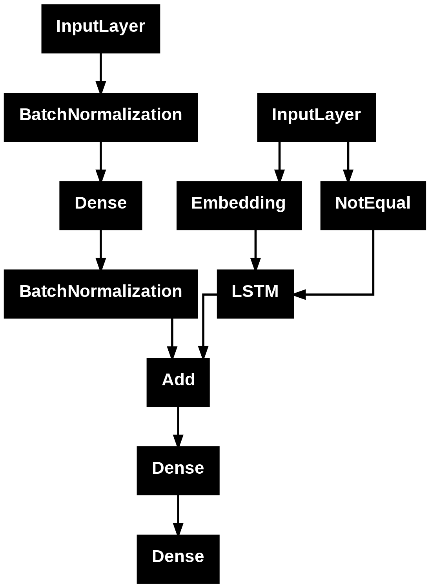

# 🖼️ Image Captioning Model

[](https://opensource.org/licenses/MIT)
[](https://www.python.org/downloads/)
[](https://www.tensorflow.org/)
[](https://keras.io/)
[](https://huggingface.co/spaces/Prabhat9801/Image_Captioning_Model)

> **🚀 [Try the Live Demo on Hugging Face Spaces!](https://huggingface.co/spaces/Prabhat9801/Image_Captioning_Model)**

An advanced deep learning project that automatically generates natural language descriptions for images using a combination of Convolutional Neural Networks (CNN) and Recurrent Neural Networks (RNN). The model employs InceptionV3 for feature extraction and LSTM for sequence generation, with both Greedy Search and Beam Search decoding strategies.

## 📋 Table of Contents

- [Overview](#overview)
- [Features](#features)
- [Model Architecture](#model-architecture)
- [Project Structure](#project-structure)
- [Installation](#installation)
- [Dataset](#dataset)
- [Usage](#usage)
- [Model Performance](#model-performance)
- [Deployment](#deployment)
- [Examples](#examples)
- [Technologies Used](#technologies-used)
- [Contributing](#contributing)
- [License](#license)
- [Acknowledgments](#acknowledgments)

## 🎯 Overview

This project implements an end-to-end image captioning system that can generate human-like descriptions of images. The model is trained on the Flickr8k dataset and uses a sophisticated encoder-decoder architecture combining computer vision and natural language processing techniques.

### Key Highlights:
- **CNN-RNN Architecture**: Combines InceptionV3 (pre-trained on ImageNet) for image feature extraction with LSTM for caption generation
- **Dual Decoding Strategies**: Implements both Greedy Search and Beam Search (K=3) for caption generation
- **BLEU Score Evaluation**: Comprehensive evaluation using BLEU-1 and BLEU-2 metrics
- **Interactive Interface**: Gradio-based web interface for easy testing and deployment
- **Pre-trained Model**: Ready-to-use trained model with saved weights and tokenizer
- **🌐 Live Demo**: [Deployed on Hugging Face Spaces](https://huggingface.co/spaces/Prabhat9801/Image_Captioning_Model) - Try it now!

## ✨ Features

- 🔍 **Feature Extraction**: Uses InceptionV3 pre-trained on ImageNet for robust image feature extraction
- 📝 **Caption Generation**: LSTM-based sequence model for generating natural language descriptions
- 🎯 **Multiple Decoding Methods**:
  - Greedy Search: Fast, deterministic caption generation
  - Beam Search: Higher quality captions with K=3 beam width
- 📊 **Performance Metrics**: BLEU-1 and BLEU-2 score evaluation
- 🖥️ **User-Friendly Interface**: Gradio web interface for easy interaction
- 💾 **Saved Model Assets**: Pre-trained model, tokenizer, and configuration files included
- 📈 **Visualization Tools**: Built-in functions to visualize predictions with actual captions

## 🏗️ Model Architecture

The image captioning model follows an encoder-decoder architecture:

### Encoder (Image Feature Extraction)
- **Model**: InceptionV3 (pre-trained on ImageNet)
- **Input**: Images resized to 299×299×3
- **Output**: 2048-dimensional feature vector
- **Purpose**: Extracts high-level visual features from input images

### Decoder (Caption Generation)
- **Model**: LSTM-based sequence model
- **Input**: Image features + partial caption sequence
- **Output**: Next word prediction
- **Embedding Layer**: Converts words to dense vectors
- **LSTM Layer**: Captures sequential dependencies in captions
- **Dense Layer**: Predicts probability distribution over vocabulary

### Caption Generation Strategies

1. **Greedy Search**:
   - Selects the most probable word at each step
   - Fast and deterministic
   - Good for real-time applications

2. **Beam Search (K=3)**:
   - Maintains top-K candidate sequences
   - Explores multiple caption possibilities
   - Produces higher quality captions
   - Better BLEU scores



## 📁 Project Structure

```
Image_Captioning_Model/
│
├── Image_Captioning_model.ipynb    # Main Jupyter notebook with complete implementation
├── README.md                        # Project documentation (this file)
├── LICENSE                          # MIT License
├── .gitignore                       # Git ignore file
├── model.png                        # Model architecture diagram
│
├── model/                           # Trained model files
│   ├── caption_model_final.h5      # Model weights (H5 format)
│   └── caption_model_final.keras   # Model weights (Keras format)
│
├── model_assets/                    # Model configuration and tokenizer
│   ├── tokenizer.pkl               # Trained tokenizer
│   └── model_config.pkl            # Model configuration (max_length, dimensions)
│
├── image_features/                  # Pre-extracted image features
│   ├── train_image_features.pkl    # Training set features (~56 MB)
│   ├── val_image_features.pkl      # Validation set features (~9 MB)
│   └── test_image_features.pkl     # Test set features (~1 MB)
│
└── huggingface_deployment/          # 🚀 Ready-to-deploy package for Hugging Face Spaces
    ├── app.py                      # Gradio web application
    ├── requirements.txt            # Python dependencies
    ├── caption_model_final.keras   # Model file (copy)
    ├── tokenizer.pkl               # Tokenizer (copy)
    ├── model_config.pkl            # Configuration (copy)
    ├── README.md                   # Deployment documentation
    ├── DEPLOYMENT_GUIDE.md         # Quick deployment guide
    ├── DEPLOYMENT_SUMMARY.md       # Complete deployment summary
    ├── test_deployment.py          # Pre-deployment validation script
    └── .gitignore                  # Git ignore file
```

## 🚀 Installation

### Prerequisites
- Python 3.8 or higher
- TensorFlow 2.x
- CUDA-compatible GPU (recommended for training)

### Setup Instructions

1. **Clone the repository**:
```bash
git clone https://github.com/Prabhat9801/Image_Captioning_Model.git
cd Image_Captioning_Model
```

2. **Create a virtual environment** (recommended):
```bash
python -m venv venv
source venv/bin/activate  # On Windows: venv\Scripts\activate
```

3. **Install required packages**:
```bash
pip install tensorflow keras numpy pandas matplotlib pillow tqdm gradio
pip install nltk scikit-learn
```

4. **Download NLTK data** (for BLEU score calculation):
```python
import nltk
nltk.download('punkt')
```

## 📊 Dataset

This project uses the **Flickr8k Dataset**, which contains:
- **8,000 images**: Diverse collection of everyday scenes and objects
- **40,000 captions**: 5 human-annotated captions per image
- **Training set**: ~6,000 images
- **Validation set**: ~1,000 images
- **Test set**: ~1,000 images

### Dataset Structure
Each image is associated with multiple reference captions in the format:
```
image_id.jpg    start caption description here end
```

**Note**: Due to size constraints, the dataset is not included in this repository. You can download it from:
- [Kaggle Flickr8k Dataset](https://www.kaggle.com/datasets/adityajn105/flickr8k)
- [Official Flickr8k](https://github.com/jbrownlee/Datasets/releases/tag/Flickr8k)

## 💻 Usage

### Using the Jupyter Notebook

1. **Open the notebook**:
```bash
jupyter notebook Image_Captioning_model.ipynb
```

2. **Follow the notebook sections**:
   - Data loading and preprocessing
   - Feature extraction with InceptionV3
   - Model training
   - Caption generation
   - Evaluation with BLEU scores
   - Visualization

### Using Pre-trained Model

```python
import pickle
import numpy as np
from tensorflow.keras.models import load_model
from tensorflow.keras.preprocessing.sequence import pad_sequences
from tensorflow.keras.applications.inception_v3 import InceptionV3, preprocess_input
from tensorflow.keras.preprocessing.image import load_img, img_to_array

# Load model and assets
model = load_model('model/caption_model_final.keras', safe_mode=False)
with open('model_assets/tokenizer.pkl', 'rb') as f:
    tokenizer = pickle.load(f)
with open('model_assets/model_config.pkl', 'rb') as f:
    config = pickle.load(f)

# Load InceptionV3 for feature extraction
inception_model = InceptionV3(weights='imagenet')
inception_model = tf.keras.Model(
    inputs=inception_model.inputs, 
    outputs=inception_model.layers[-2].output
)

# Function to generate caption
def generate_caption(image_path):
    # Load and preprocess image
    img = load_img(image_path, target_size=(299, 299))
    img = img_to_array(img)
    img = np.expand_dims(img, axis=0)
    img = preprocess_input(img)
    
    # Extract features
    features = inception_model.predict(img, verbose=0)
    features = features.flatten()
    
    # Generate caption using greedy search
    in_text = 'start'
    for _ in range(config['max_caption_length']):
        sequence = tokenizer.texts_to_sequences([in_text])[0]
        sequence = pad_sequences([sequence], maxlen=config['max_caption_length'])
        prediction = model.predict([features.reshape(1, -1), sequence], verbose=0)
        idx = np.argmax(prediction)
        word = tokenizer.index_word[idx]
        in_text += ' ' + word
        if word == 'end':
            break
    
    caption = in_text.replace('start ', '').replace(' end', '')
    return caption

# Generate caption for an image
caption = generate_caption('path/to/your/image.jpg')
print(f"Generated Caption: {caption}")
```

### Using Gradio Interface

The notebook includes a Gradio interface for easy testing:

```python
# The interface is defined in the notebook
# Simply run the last cells to launch the web interface
iface.launch()
```

This will start a local web server where you can:
- Upload images
- Get captions using both Greedy Search and Beam Search
- Compare the results

## 📈 Model Performance

The model is evaluated using BLEU (Bilingual Evaluation Understudy) scores:

### Evaluation Metrics
- **BLEU-1**: Measures unigram precision (individual word matches)
- **BLEU-2**: Measures bigram precision (two consecutive word matches)

### Performance Characteristics
- **Greedy Search**: Faster inference, good for real-time applications
- **Beam Search (K=3)**: Higher BLEU scores, better caption quality

### Sample Results
The model generates captions like:
- "a dog is running through the grass"
- "a group of people are standing on a beach"
- "a child is playing with a ball"

*Note: Actual performance metrics depend on the training configuration and dataset split.*

## 🌐 Deployment

### 🎉 Live Demo

**The model is now deployed and available online!**

🔗 **[Try it now on Hugging Face Spaces](https://huggingface.co/spaces/Prabhat9801/Image_Captioning_Model)**

Upload any image and get instant captions using both Greedy Search and Beam Search algorithms!

---

### 🚀 Quick Deploy to Hugging Face Spaces (5 Minutes)

This repository includes a **ready-to-deploy package** in the `huggingface_deployment/` folder with everything you need!

#### Option 1: Use the Ready-Made Deployment Folder (Recommended)

All files are already prepared in `huggingface_deployment/`:

1. **Navigate to the deployment folder**:
```bash
cd huggingface_deployment
```

2. **Run the pre-deployment test** (optional but recommended):
```bash
python test_deployment.py
```

3. **Create a Hugging Face Space**:
   - Go to [Hugging Face Spaces](https://huggingface.co/spaces)
   - Click "Create new Space"
   - Name: `image-captioning-demo` (or your choice)
   - SDK: Select **Gradio**
   - Visibility: Public or Private

4. **Upload all files** from the `huggingface_deployment/` folder:
   - `app.py`
   - `requirements.txt`
   - `caption_model_final.keras`
   - `tokenizer.pkl`
   - `model_config.pkl`

5. **Wait for automatic build** (5-10 minutes)

6. **Your app is live!** 🎉

For detailed instructions, see:
- `huggingface_deployment/DEPLOYMENT_GUIDE.md` - Quick 5-minute guide
- `huggingface_deployment/DEPLOYMENT_SUMMARY.md` - Complete deployment documentation
- `huggingface_deployment/README.md` - Technical details

#### Option 2: Manual Setup

If you prefer to set up from scratch, follow the notebook's deployment section.

### Local Deployment

Run the Gradio interface locally:
```bash
cd huggingface_deployment
python app.py
```

Then open your browser to `http://localhost:7860`

## 🎨 Examples

### Example 1: Dog Playing
**Input Image**: Dog running in a park  
**Greedy Caption**: "a dog is running through the grass"  
**Beam Search Caption**: "a brown dog is running through the grass"

### Example 2: Beach Scene
**Input Image**: People on a beach  
**Greedy Caption**: "a group of people are on the beach"  
**Beam Search Caption**: "a group of people are standing on a sandy beach"

### Example 3: Child Playing
**Input Image**: Child with a ball  
**Greedy Caption**: "a child is playing with a ball"  
**Beam Search Caption**: "a young child is playing with a red ball"

*Note: Add your own example images to the `examples/` directory for demonstration.*

## 🛠️ Technologies Used

### Deep Learning Frameworks
- **TensorFlow 2.x**: Primary deep learning framework
- **Keras**: High-level neural networks API

### Pre-trained Models
- **InceptionV3**: CNN for image feature extraction (ImageNet weights)

### Natural Language Processing
- **NLTK**: Natural Language Toolkit for BLEU score calculation
- **Tokenization**: Custom tokenizer for caption vocabulary

### Data Processing
- **NumPy**: Numerical computations
- **Pandas**: Data manipulation
- **Pillow (PIL)**: Image processing

### Visualization & Interface
- **Matplotlib**: Plotting and visualization
- **Gradio**: Interactive web interface

### Development Tools
- **Jupyter Notebook**: Interactive development environment
- **tqdm**: Progress bars for training loops

## 🤝 Contributing

Contributions are welcome! Here's how you can help:

1. **Fork the repository**
2. **Create a feature branch**: `git checkout -b feature/AmazingFeature`
3. **Commit your changes**: `git commit -m 'Add some AmazingFeature'`
4. **Push to the branch**: `git push origin feature/AmazingFeature`
5. **Open a Pull Request**

### Areas for Improvement
- [ ] Add attention mechanism for better caption quality
- [ ] Implement transformer-based architecture
- [ ] Support for multiple languages
- [ ] Fine-tune on domain-specific datasets
- [ ] Add more evaluation metrics (METEOR, CIDEr, ROUGE)
- [ ] Optimize model for mobile deployment
- [ ] Add data augmentation techniques
- [ ] Implement caption diversity metrics

## 📄 License

This project is licensed under the MIT License - see the [LICENSE](LICENSE) file for details.

```
MIT License

Copyright (c) 2025 Prabhar Kumar Singh

Permission is hereby granted, free of charge, to any person obtaining a copy
of this software and associated documentation files (the "Software"), to deal
in the Software without restriction, including without limitation the rights
to use, copy, modify, merge, publish, distribute, sublicense, and/or sell
copies of the Software, and to permit persons to whom the Software is
furnished to do so, subject to the following conditions:

The above copyright notice and this permission notice shall be included in all
copies or substantial portions of the Software.
```

## 🙏 Acknowledgments

- **Flickr8k Dataset**: Thanks to the creators of the Flickr8k dataset for providing a valuable resource for image captioning research
- **InceptionV3**: Google's pre-trained InceptionV3 model for feature extraction
- **TensorFlow & Keras**: For providing excellent deep learning frameworks
- **Gradio**: For making it easy to create interactive ML demos
- **Research Papers**: Inspired by seminal works in image captioning:
  - "Show and Tell: A Neural Image Caption Generator" (Vinyals et al., 2015)
  - "Show, Attend and Tell: Neural Image Caption Generation with Visual Attention" (Xu et al., 2015)

## 📧 Contact

**Prabhar Kumar Singh**  
- GitHub: [@Prabhat9801](https://github.com/Prabhat9801)
- Project Link: [https://github.com/Prabhat9801/Image_Captioning_Model](https://github.com/Prabhat9801/Image_Captioning_Model)
- Live Demo: [https://huggingface.co/spaces/Prabhat9801/Image_Captioning_Model](https://huggingface.co/spaces/Prabhat9801/Image_Captioning_Model)

---

<div align="center">

**If you find this project useful, please consider giving it a ⭐ star!**

Made with ❤️ by Prabhar Kumar Singh

</div>
